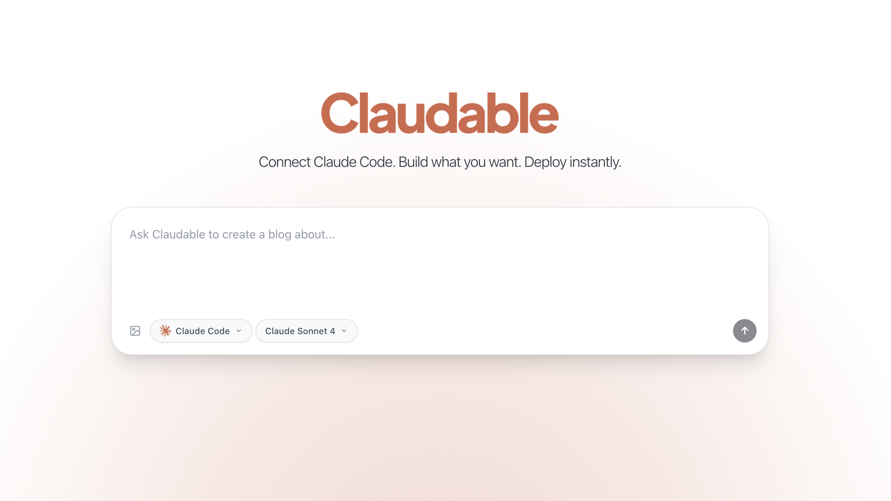

# Claudable


<div align="center">
<h3>Connect Claude Code. Build what you want. Deploy instantly.</h3>

<p>Powered by <a href="https://opactor.ai">OPACTOR</a></p>
</div>
<p align="center">
<a href="https://discord.gg/NJNbafHNQC">

</a>
</p>

## What is Claudable?

Claudable is a powerful Next.js-based web app builder that combines **C**laude Code's (Cursor CLI also supported!) advanced AI agent capabilities with **Lovable**'s simple and intuitive app building experience. Just describe your app idea - "I want a task management app with dark mode" - and watch as Claudable instantly generates the code and shows you a live preview of your working app. You can deploy your app to Vercel and integrate database with Supabase for free.

This open-source project empowers you to build and deploy professional web applications easily for **free**.

How to start? Simply login to Claude Code (or Cursor CLI), start Claudable, and describe what you want to build. That's it. There is no additional subscription cost for app builder. 

## Features


- **Powerful Agent Performance**: Leverage the full power of Claude Code and Cursor CLI Agent capabilities with native MCP support
- **Natural Language to Code**: Simply describe what you want to build, and Claudable generates production-ready Next.js code
- **Instant Preview**: See your changes immediately with hot-reload as AI builds your app
- **Zero Setup, Instant Launch**: No complex sandboxes, no API key, no database headaches - just start building immediately
- **Beautiful UI**: Generate beautiful UI with Tailwind CSS and shadcn/ui
- **Deploy to Vercel**: Push your app live with a single click, no configuration needed
- **GitHub Integration**: Automatic version control and continuous deployment setup
- **Supabase Database**: Connect production PostgreSQL with authentication ready to use
- **Automated Error Detection**: Detect errors in your app and fix them automatically

## Technology Stack
**AI Cooding Agent:**
- **[Claude Code](https://docs.anthropic.com/en/docs/claude-code/setup)**: Advanced AI coding agent. We strongly recommend you to use Claude Code for the best experience.
  ```bash
  # Install
  npm install -g @anthropic-ai/claude-code
  # Login
  claude  # then > /login
  ```
- **[Cursor CLI](https://docs.cursor.com/en/cli/overview)**: Intelligent coding agent for complex coding tasks. It's little bit slower than Claude Code, but it's more powerful.
  ```bash
  # Install
  curl https://cursor.com/install -fsS | bash
  # Login
  cursor-agent login
  ```

**Database & Deployment:**
- **[Supabase](https://supabase.com/)**: Connect production-ready PostgreSQL database directly to your project.
- **[Vercel](https://vercel.com/)**: Publish your work immediately with one-click deployment

**There is no additional subscription cost and built just for YOU.**

## Prerequisites

Before you begin, ensure you have the following installed:
- Node.js 18+
- Python 3.10+
- Claude Code or Cursor CLI (already logged in)
- Git

## Quick Start

Get Claudable running on your local machine in minutes:

```bash
# Clone the repository
git clone https://github.com/opactorai/Claudable.git
cd Claudable

# Install all dependencies (Node.js and Python)
npm install

# Start development servers
npm run dev
```

Your application will be available at:
- Frontend: http://localhost:3000
- API Server: http://localhost:8080
- API Documentation: http://localhost:8080/docs

**Note**: Ports are automatically detected. If the default ports are in use, the next available ports will be assigned.

## Setup

### Manual Setup
You can also manually setup the project.
```bash
# Frontend setup
cd apps/web
npm install

# Backend setup
cd ../api
python3 -m venv .venv
source .venv/bin/activate  # On Windows: .venv\Scripts\activate
pip install -r requirements.txt
```

The `npm install` command automatically handles the complete setup:

1. **Port Configuration**: Detects available ports and creates `.env` files
2. **Node.js Dependencies**: Installs packages including workspace dependencies
3. **Python Environment**: Creates virtual environment in `apps/api/.venv`
4. **Python Dependencies**: Installs packages using `uv` (if available) or `pip`
5. **Database Setup**: SQLite database auto-creates at `data/cc.db` on first run

### Additional Commands
```bash
npm run db:backup   # Create a backup of your SQLite database
                    # Use when: Before major changes or deployments
                    # Creates: data/backups/cc_backup_[timestamp].db

npm run db:reset    # Reset database to initial state
                    # Use when: Need fresh start or corrupted data
                    # Warning: This will delete all your data!

npm run clean       # Remove all dependencies and virtual environments
                    # Use when: Dependencies conflict or need fresh install
                    # Removes: node_modules/, apps/api/.venv/, package-lock.json
                    # After running: npm install to reinstall everything
```

## Usage

### Getting Started with Development

1. **Connect Claude Code**: Link your Claude Code CLI to enable AI assistance
2. **Describe Your Project**: Use natural language to describe what you want to build
3. **AI Generation**: Watch as the AI generates your project structure and code
4. **Live Preview**: See changes instantly with hot reload functionality
5. **Deploy**: Push to production with Vercel integration

### API Development

Access the interactive API documentation at http://localhost:8080/docs to explore available endpoints and test API functionality.

### Database Operations

Claudable uses SQLite for local development and can be configured for PostgreSQL in production. The database automatically initializes on first run.

## Troubleshooting

### Port Already in Use

The application automatically finds available ports. Check the `.env` file to see which ports were assigned.

### Installation Failures

```bash
# Clean all dependencies and retry
npm run clean
npm install
```

### Permission Errors (macOS/Linux)

If you encounter permission errors:
```bash
cd apps/api
python3 -m venv .venv
source .venv/bin/activate
pip install -r requirements.txt
```

## Integration Guide

### GitHub
**Get Token:** [GitHub Personal Access Tokens](https://github.com/settings/tokens) → Generate new token (classic) → Select `repo` scope

**Connect:** Settings → Service Integrations → GitHub → Enter token → Create or connect repository

### Vercel  
**Get Token:** [Vercel Account Settings](https://vercel.com/account/tokens) → Create Token

**Connect:** Settings → Service Integrations → Vercel → Enter token → Create new project for deployment

### Supabase
**Get Credentials:** [Supabase Dashboard](https://supabase.com/dashboard) → Your Project → Settings → API
- Project URL: `https://xxxxx.supabase.co`  
- Anon Key: Public key for client-side
- Service Role Key: Secret key for server-side

## License

MIT License.